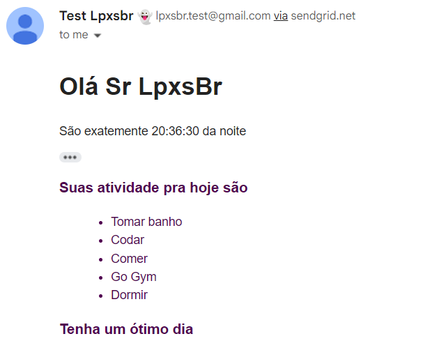

# Email sender

## Tecnologies

Node.Js

### modules

- dotenv
- sendmailer

---
## How to run

In your terminal

```Clone this project```

```code project-folder``` * open vscode/code editor

you need of a .env file with:

```API_KEY_SMTP = "YOUT API KEY :)"```

after

```cd project-folder```

install dependencies

```npm i```

run

```npm run```

send your email :)

----

## screenshots

